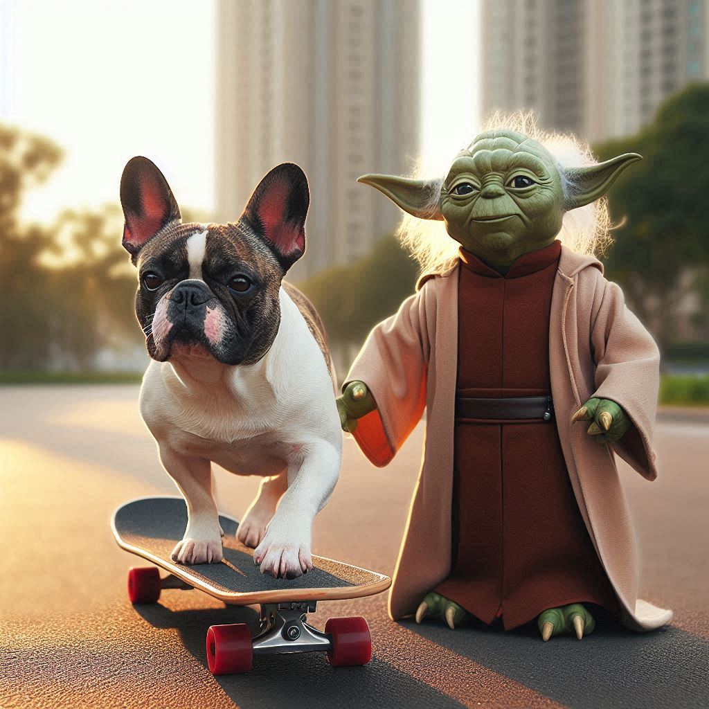
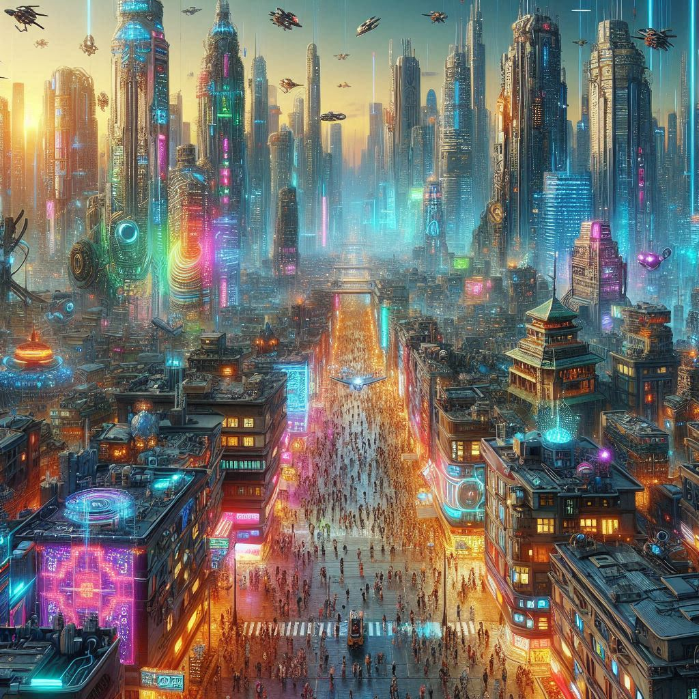

## Input para imagem 1

```
Faça um cachorro da raça bulldog andando de skate em um parque em companhia com o mestre yoda
```

## Output



## Input para imagem 2

```
Faça um retrato de uma cidade em um mundo distópico de Cyberpunk
```

## Output


